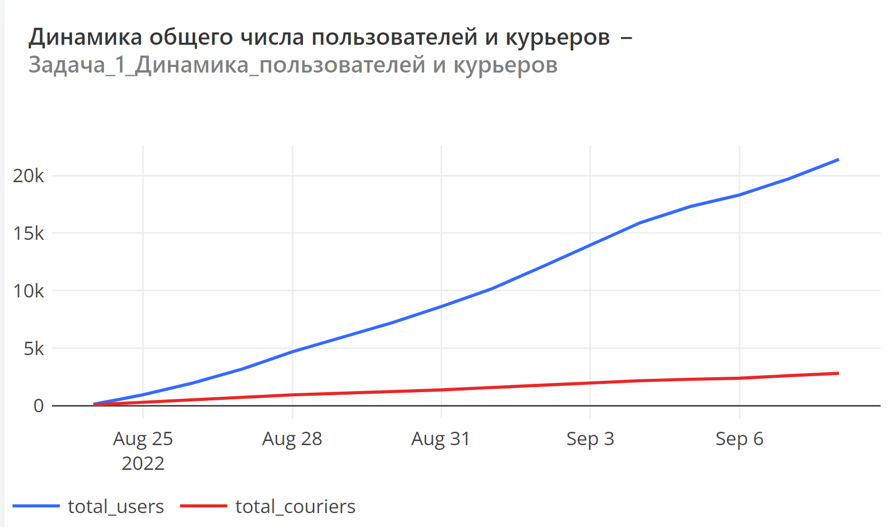
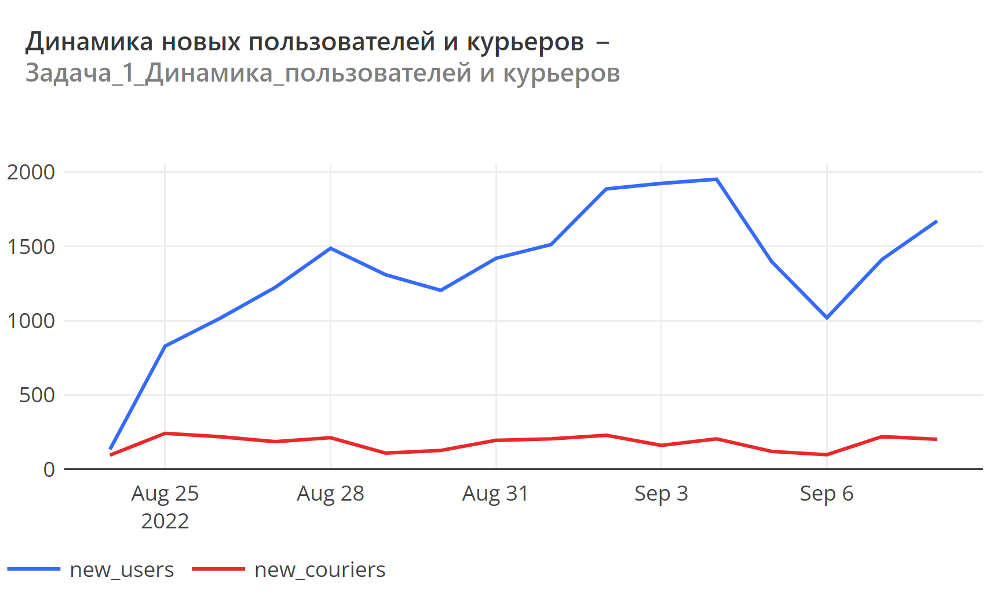

# **Задача 1.**
Для начала давайте проанализируем, насколько быстро растёт аудитория нашего сервиса, и посмотрим на динамику числа пользователей и курьеров. 

## **Задание:**

Для каждого дня, представленного в таблицах user_actions и courier_actions, рассчитайте следующие показатели:

* Число новых пользователей.
* Число новых курьеров.
* Общее число пользователей на текущий день.
* Общее число курьеров на текущий день.

Колонки с показателями назовите соответственно new_users, new_couriers, total_users, total_couriers. Колонку с датами назовите date. Проследите за тем, чтобы показатели были выражены целыми числами. Результат должен быть отсортирован по возрастанию даты.

Поля в результирующей таблице: date, new_users, new_couriers, total_users, total_couriers

## **Пояснение:**

Новыми будем считать тех пользователей и курьеров, которые в данный день совершили своё первое действие в нашем сервисе. Общее число пользователей/курьеров на текущий день — это результат сложения числа новых пользователей/курьеров в текущий день со значениями аналогичного показателя всех предыдущих дней.

После того как составите запрос, попробуйте визуализировать результаты и постройте графики, отражающие динамику рассчитанных показателей.

Предлагаем вам построить два графика: на один поместить динамику новых пользователей и курьеров, а на второй — рост их общего числа.

## **SQL Запрос:**
~~~~sql
SELECT u.t as date,
       new_users,
       (sum(new_users) OVER(ORDER BY u.t))::int as total_users,
       new_couriers,
       (sum(new_couriers) OVER(ORDER BY u.t))::int as total_couriers
FROM   (SELECT time::date as t,
               count(distinct user_id) filter (WHERE rank = 1) as new_users
        FROM   (SELECT time::date,
                       user_id,
                       rank() OVER(PARTITION BY user_id
                                   ORDER BY time::date)
                FROM   user_actions) sub
        GROUP BY 1) u join (SELECT time::date as t,
                           count(distinct courier_id) filter (WHERE rank = 1) as new_couriers
                    FROM   (SELECT time::date,
                                   courier_id,
                                   rank() OVER(PARTITION BY courier_id
                                               ORDER BY time::date)
                            FROM   courier_actions) sub1
                    GROUP BY 1) c
        ON u.t = c.t
~~~~

## **Графики:**
Ссылка на redash http://redash.public.karpov.courses/public/dashboards/EukzAkDwpsZD2zl5sSM83SsWvW6S0PyaAlI4gpEL?org_slug=default

