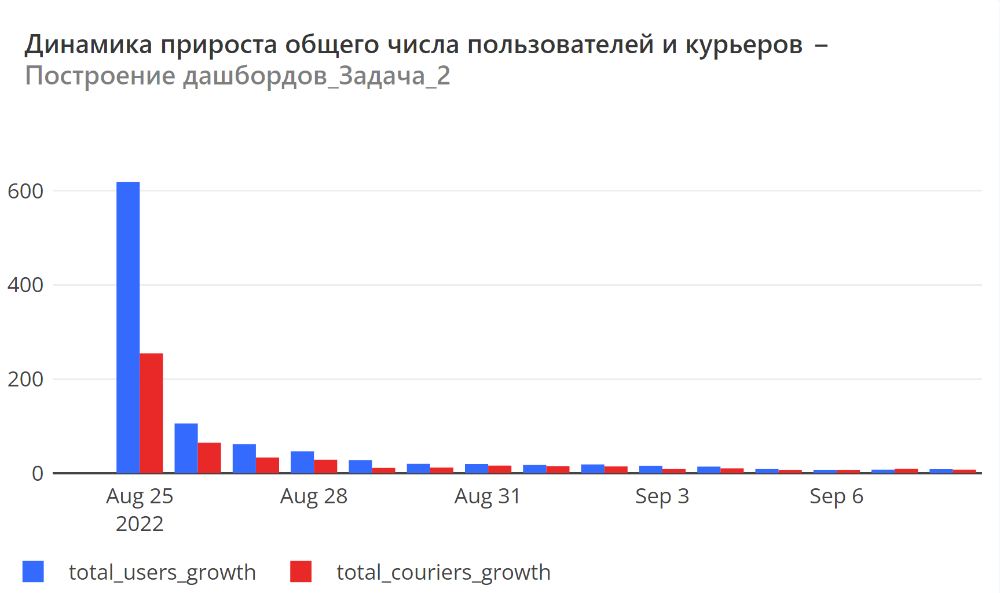

# **Задача 2.**

Анализируя динамику показателей из предыдущего задания, вы могли заметить, что сравнивать абсолютные значения не очень удобно. Давайте посчитаем динамику показателей в относительных величинах.

## **Задание:**

Дополните запрос из предыдущего задания и теперь для каждого дня, представленного в таблицах user_actions и courier_actions, дополнительно рассчитайте следующие показатели:

*	Прирост числа новых пользователей.
*	Прирост числа новых курьеров.
*	Прирост общего числа пользователей.
*	Прирост общего числа курьеров.
Показатели, рассчитанные на предыдущем шаге, также включите в результирующую таблицу.

Колонки с новыми показателями назовите соответственно new_users_change, new_couriers_change, total_users_growth, total_couriers_growth. Колонку с датами назовите date.

Все показатели прироста считайте в процентах относительно значений в предыдущий день. При расчёте показателей округляйте значения до двух знаков после запятой.
Результирующая таблица должна быть отсортирована по возрастанию даты.

Поля в результирующей таблице:
date, new_users, new_couriers, total_users, total_couriers, new_users_change, new_couriers_change, total_users_growth, total_couriers_growth

Пояснение:
Не забывайте при делении заранее приводить значения к нужному типу данных. Пропущенные значения приростов для самой первой даты не заполняйте — просто оставьте поля в этой строке пустыми.
#%%
SELECT
    date,
    new_users,
    total_users,
    new_couriers,
    (sum(new_couriers) OVER(ORDER BY date))::int as total_couriers,
    new_users_change,
    new_couriers_change,
    round(((total_users - lag(total_users) OVER(ORDER BY date))::decimal / lag(total_users) OVER(ORDER BY date)) * 100, 2) as total_users_growth,
    round(((total_couriers - lag(total_couriers) OVER(ORDER BY date))::decimal / lag(total_couriers) OVER(ORDER BY date)) * 100, 2) as total_couriers_growth
FROM
(SELECT u.t as date,
       new_users,
       (sum(new_users) OVER(ORDER BY u.t))::int as total_users,
       new_couriers,
       (sum(new_couriers) OVER(ORDER BY u.t))::int as total_couriers,
       round((((new_users - (lag(new_users) OVER(ORDER BY u.t))::int) / lag(new_users) OVER(ORDER BY u.t)::decimal)) * 100, 2)  as new_users_change,
       round((((new_couriers - (lag(new_couriers) OVER(ORDER BY u.t))::int) / lag(new_couriers) OVER(ORDER BY u.t)::decimal)) * 100, 2) as new_couriers_change
FROM   (SELECT time::date as t,
               count(distinct user_id) filter (WHERE rank = 1) as new_users
        FROM   (SELECT time::date,
                       user_id,
                       rank() OVER(PARTITION BY user_id
                                   ORDER BY time::date)
                FROM   user_actions) sub
        GROUP BY 1) u join (SELECT time::date as t,
                           count(distinct courier_id) filter (WHERE rank = 1) as new_couriers
                    FROM   (SELECT time::date,
                                   courier_id,
                                   rank() OVER(PARTITION BY courier_id
                                               ORDER BY time::date)
                            FROM   courier_actions) sub1
                    GROUP BY 1) c
        ON u.t = c.t) s

